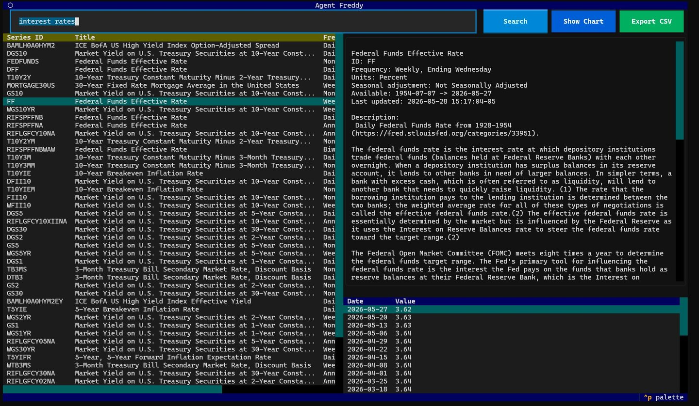

# agent-freddy

`agent-freddy` is a small Python MVP for finding FRED time series and pulling observations from the terminal.
It includes both a Click-based CLI and an interactive Textual TUI.

## Setup

1. Install dependencies:

```bash
uv sync
```

2. Get a FRED API key: https://fred.stlouisfed.org/docs/api/api_key.html
3. Set it in your shell:

```bash
export FRED_API_KEY="your_32_char_key"
```

## Click CLI

Search for series by keyword:

```bash
uv run fred search "unemployment rate" --limit 5
```

Describe metadata and availability:

```bash
uv run fred describe UNRATE
```

Pull observations to stdout:

```bash
uv run fred pull UNRATE --limit 12 --sort-order desc
```

Show command help:

```bash
uv run fred --help
```

## Textual interface

Launch the interactive explorer:

```bash
uv run fred tui
```

<p align="center">
  
</p>

In the TUI:
- Type a query and press Enter (or click Search).
- Select a result row to view description and recent observations.
- Use **Show Chart** to open a popup with a date-based line chart and editable start/end date fields.
- Use **Export CSV** to open a path prompt (prefilled to `.export/<SERIES_ID>.csv`) and write all available observations.
- Press `q` to quit.

## Development checks

Install pre-commit hooks with:

```bash
uv run pre-commit install
```

Run tests and linting with:

```bash
uv run ruff check .
uv run pytest
```

Run pre-commit checks with:

```bash
uv run pre-commit run --all-files
```

Or if you have `make` installed, you can run these commands like so:

```bash
make pre-commit-install
make pre-commit
make lint
make test
```
